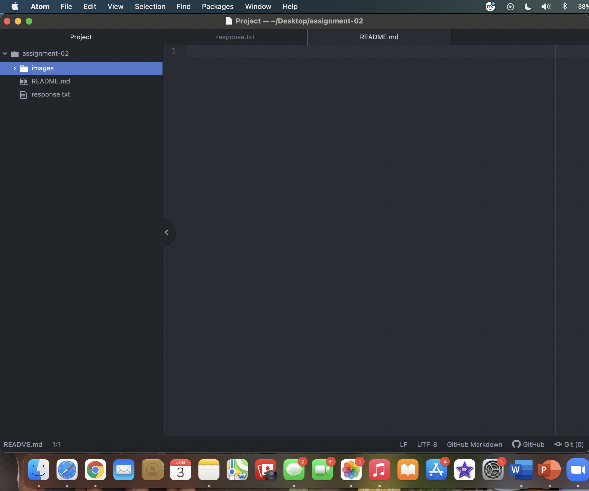

# Assignment-02
## Katie Schlichenmayer

I decided to take this class because it sounded the most interesting out of the list of classes I could take to complete my digital marketing certificate. I believe this class could also come in hand in the future depending on what I end up doing for a career. Web design is something I have never done before and I thought that it would be good to gain another skill in something new. I am excited to learn more throughout the course of this class.

List of things Ive learned or hope to learn:

- Learned what atom is
- I have learned more information about the internet.
- I hope to learn even more about web design as the class progresses.

[DuckDuckGo](https://duckduckgo.com)

[My Response File](./response.txt)

