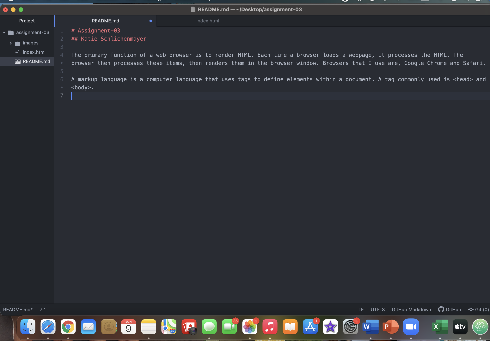

# Assignment-03
## Katie Schlichenmayer

The primary function of a web browser is to render HTML. Each time a browser loads a webpage, it processes the HTML. The browser then processes these items, then renders them in the browser window. Browsers that I use are, Google Chrome and Safari.

A markup language is a computer language that uses tags to define elements within a document. A tag commonly used is <head> and <body>.

